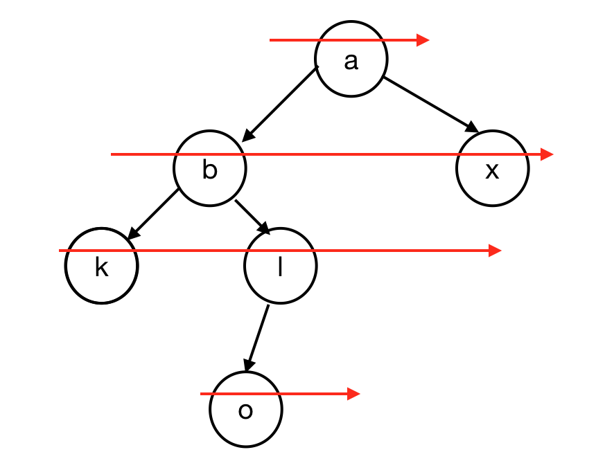
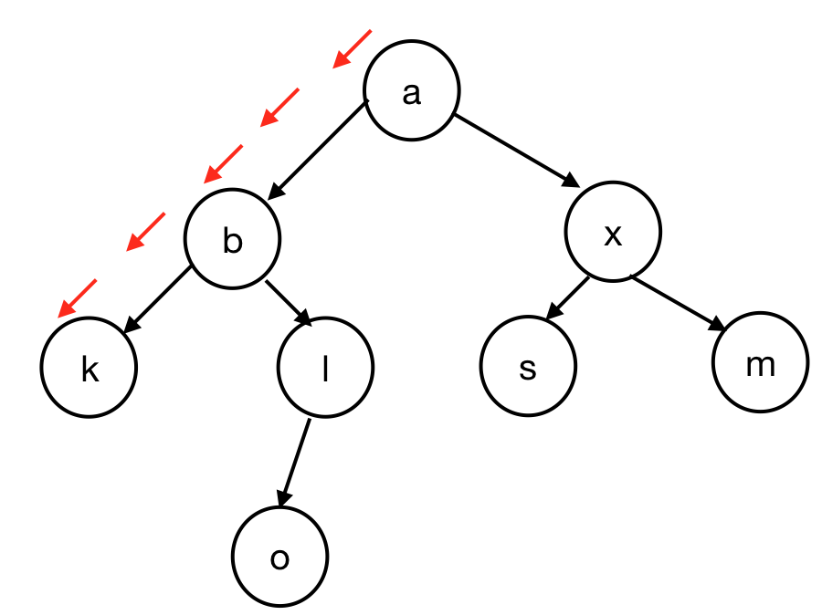

# CS225 Final Exam Review

This is a study guide I created to help prepare for the scary CS225 final exam at U of I! This is by no means complete, I only included content that *I* found unfamiliar. 

# Study Resources

- [Lecture Slides (`/slides`)](/slides)
- [Lecture Hangouts (`/handouts`)](/handouts)
- [Lecture Code (`/code`)](/code)
- [Lecture Notes by TAs (`/notes`)](/notes)

# Final Exam Topics

- [C++ Basics](cpp.md)
- [Abstract Data Types (ADT)](adt.md)
  - List ADT
  - Stack ADT
  - Queue ADT
  - Iterator
- [Trees](tree.md)
  - Binary Tree
  - Traversal
  - Search
  - BST Binary Search Tree
  - AVL Tree
- kd-Tree
- BTree
- Hashing
- Heaps
- Disjoint Sets
- Graphs
- Minimum Spanning Tree (MST)
- Prim's MST
- Single Source Shortest Path (SSSP)
- All Pairs Shortest Path (APSP)

# C++ Basics

### Encapsulation

Separate the interface from implementation but still keep them as a cohesive unit.

### `#pragma once`

Telling compiler that this particular file will be included only once within this single compilation. 

### Reference Variable

An alias to an existing variable. Never creates new memory.

### Pointers

Stores a memory address of the instance instead of storing data.

### Stack Memory 

Default type memory, starts near the top of memory.

### Heap Memory

- Starts from low memory values and grows up. 
- Use `new` to create, `delete` to free. 
- Memory leak is when we don't `delete` when done.

### `const` Function Parameter

- `Cube joinCubes(const Cube & c1)` to prevent the parameters passed in to be changed. 
- `double getVolume() const;` means that `getVolume()` guarantees it will not modify the value.

### `virtual` Function

- Allow us to override the function in derived classes.

Let's say we have 2 classes...
```cpp
class Animal
{
    public:
        _____ void eat() { std::cout << "I'm eating generic food."; }
};

class Cat : public Animal
{
    public:
        void eat() { std::cout << "I'm eating a rat."; }
};
```

and I create these in `main.cpp`...
```cpp
Animal *animal = new Animal;
Cat *cat = new Cat;
```

this should be easy...
```cpp
animal->eat(); // Outputs: "I'm eating generic food."
cat->eat();    // Outputs: "I'm eating a rat."
```

but now with this new function I created in `main.cpp`...
```cpp
void func(Animal *xyz) { xyz->eat(); }
```

Case 1, `void eat()...` in `class Animal` (without `virtual`):

```cpp
func(animal); // Outputs: "I'm eating generic food."
func(cat);    // Outputs: "I'm eating generic food."
```

Case 2, `virtual void eat()...` in `class Animal` (with `virtual`):
```cpp
func(animal); // Outputs: "I'm eating generic food."
func(cat);    // Outputs: "I'm eating a rat."
```

### Templates

- A dynamic data type
- Using `Template <typename T>` so that we do not need to write same function for various types

```cpp
template <typename T>
T maximum(T a, T b) {
     T result;
     result = (a > b) ? a : b;
     return result;
}
```

# Abstract Data Types (ADT)

ADT describes functionality but not implementation details.

## List ADT

{:height="50%" width="50%"}

|                              | Singly Linked List | ArrayList                             |
| ---------------------------- | ------------------ | ------------------------------------- |
| Insert/Remove at Front       | O(1)               | O(1) (amortized)                      |
| Insert at a given element    | O(1)               | O(n) (needs to copy everything after) |
| Remove a given element       | O(1)               | O(n)                                  |
| Insert an arbitrary element  | O(n)               | O(n)                                  |
| Remove at arbitrary location | O(n)               | O(n)                                  |

### Linked List

```cpp
// Implementation

template <typename T>
class List {
     public:
          /* ... */
     private:    
         class ListNode {
              T & data;
              ListNode * next;
              ListNode(T & data) : data(data), next(NULL) { }
         };
};
```

```cpp
// Find: Recursive

template <typename T>
typename List<T>::ListNode *& List<T>::_index(unsigned index) {
  return _index_helper(index, _head);
}

ListNode *& _index_helper(unsigned index, ListNode *& node) {
  if (index == 0) {
    return node;
  } else {
    return _index_helper(index - 1, node -> next);
}
```

```cpp
// Find: Iterative
//       Moving the pointer one by one until it's at the right location.

template <typename T>
typename List<T>::ListNode *& List<T>::_index(unsigned index) {
  if (index == 0) {
    return head;
  } else {
    ListNode *thru = head;
    for (unsigned i = 0; i < index - 1; i++) {
      thru = thru->next;
    }
    return thru->next;
  }
}
```

```cpp
// Operator []

template <typename T>
T & List<T>::operator[](unsigned index) {
  ListNode *& d = _index(index);
  return d -> data;
}
```

```cpp
// Insert

template <typename T>
void List<T>::insert(const T & t, unsigned index) {
  ListNode *& node = _index(index);
  ListNode * newNode = new ListNode(t);
  newNode -> next = node;
  node = newNode;
}
```

## Stack

Like dining hall plates.

- push
- pop

## Queue 

Like a line is Disneyland.

- enqueue
- dequeue

## Iterator (on List)

To implement an iterator, must have
- `begin()`
- `end()`
- `operator++`
- `operator*`
- `operator!=`

```cpp
for (std::vector<Animal>::iterator it = zoo.begin(); it != zoo.end(); it++) {
  std::cout << (*it).name << " " << (*it).food << std::endl;
}
```

# Trees

{:height="50%" width="50%"}

## Binary Trees

Each node has **at most** 2 children.

### Full Tree

Each node has either 2 or 0 children.

### Perfect Tree

Full tree + all leaves same distance from root.

### Complete Tree

Full tree + perfect tree except last level, where all leaves are "pushed to the left."

## Traversal

To **traverse** a tree means we process every element exactly once in a tree.

```cpp
// pre-order

void BinaryTree<T>::preOrder(TreeNode * cur) {
  if (cur != NULL) {
    print(cur->data);     // print is some imaginary function
    preOrder(cur->left);
    preOrder(cur->right);
  }
}
```

```cpp
// in-order

void BinaryTree<T>::inOrder(TreeNode * cur) {
  if (cur != NULL) {
    inOrder(cur->left);
    print(cur->data); 
    inOrder(cur->right);
  }
}
```

```cpp
// post-order

void BinaryTree<T>::postOrder(TreeNode * cur) {
  if (cur != NULL) {
    postOrder(cur->left);
    postOrder(cur->right);
    print(cur->data);  
  }
}
```

## Search

### BFS

- Visit nearby nodes quickly by each level.
- In other words, visit the direct descendants quicker (level-order traversal).

{:height="50%" width="50%"}

### DFS

- Find the endpoint of a path quickly, and to move deeper into the tree as quickly as possible.
- In other words, we visit the leaves as soon as possible. 

{:height="50%" width="50%"}